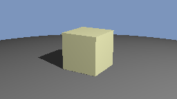
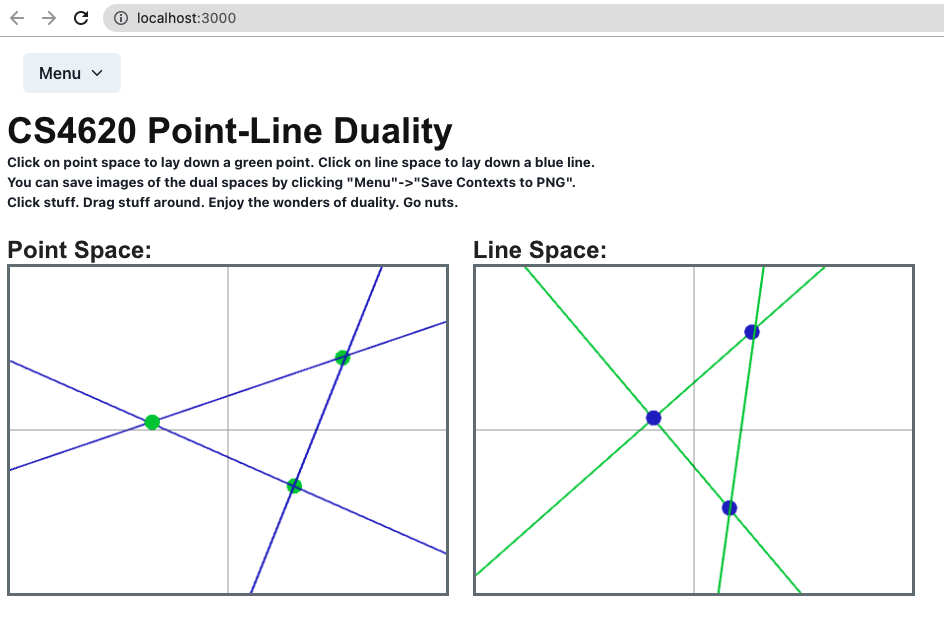

Assignment 4: Ray Tracing

1. Implement ray-sphere intersection and ray generation.  Then you can make a provisional outer loop that intersects the eye ray with the first object in the scene, returning white on a hit and black on a miss, to get an image like this for `two_spheres.py`:

2. Implement scene intersection and stub in shading to just return the object's diffuse color.  Return the background color for misses.  That will get you to this rendering for `three_spheres.py`:

3. Implement diffuse shading.

4. Add specular shading.

5. Add the shadow test.

6. Implement ray-triangle intersection, resulting in the following for `cube.py`.

  

7. Implement mirror reflection, resulting in the following for `three_spheres.py`.

  

## Creative part

Our group used the sphere class for building our 3d objects in the rendered image. A Kirby character was built by overlapping spheres. There are also many spheres of different color and size floating in the air. Each of the spheres applied the Blinn-Phong shading. We used five light sources each with different color to give our image more complex and colorful lighting.

DEMO:

​                         	  

# Assignment 2

Welcome to Assignment 2! In this assignment, we'll be implementing some of the most fundamental (and common) functionality of graphical software. By the time you are done, you will never look at Powerpoint the same way again...

### [Part 1: Setting PRSA with a matrix and a position vector](src/A2/math/NodeTransform2D.ts)

Implement the math library

### [Part 2: Basic 2D shape manipulation controls](src/A2/mvc/selection/A2AppSelectionController.ts)

 change the shape's position when bounding box corners are dragged, and applies the opposite translation when the `alt` or `shift` keys are pressed.
Implment the following:

- **Scale** the shape around its anchor when a bounding box corner is dragged
- **Scale uniformly** (the shape's x and y proportions do not change) around its anchor when a bounding box corner is dragged *and* the `shift` key is pressed
- **Rotate** the shape around its anchor when a bounding box corner is dragged *and* the `alt` key is pressed
- **Scale** the shape around the center of its bounding box when a bounding box corner is dragged and **both** the `alt` and `shift` keys are pressed. For this last part in particular you may find the `setWithMatrix` method you implemented in part 1 useful.

### [Part 3: Basic Subdivision](src/A2/viewcomponent/BasicSubdivision.ts)

For the last part of the core assignment you will add some custom functionality to the scene view shown on the right side of our application. Your task will be to implement a simple type of curve subdivision, which provides a way to generate a smooth curves based on low-resolution input polygons. 

## Final Demo:

# Assignment 3: Imaging

Implemented:

* [Photography.ipynb](./Photography.ipynb) Pointwise transformations apply to every pixel separately.  We will use them to compute good-looking 8-bit color images from raw camera sensor data. The curve adjustments we learned about in class fall under this category.

DEMO of white balancing:

* [Filtering.ipynb](./Filtering.ipynb) Convolution filters involve computing weighted sums over a local area of the image.  We will use them to simulate out-of-focus blur and to sharpen images.

DEMO of gaussian filter and sharpen filter:

* [Distortion.ipynb](Distortion.ipynb) Image warping involves moving content around in an image.  We will apply a simple image warp that corrects for the distortion in a wide angle lens.

  DEMO:

  

- [CreativePart.ipynb](./CreativePart.ipynb) in the creative part, I implemented edge detection using sobel kernel and set obvious edges with a RGB value. I built this filter to mimic the effect of a color pencil sketch

  

# Assignment 1: Point-Line Duality 

In this assignment you will complete the basic mathematical functions underlying an application for visualizing Point Space and Line Space. The application will display two windows: a Point Space window on the left, and a Line Space window on the right (see example images at the bottom of this README). When you click inside the Point Space window, it will create a draggable green point in Point Space. At the same time, in Line Space, we will see the coordinates of any line that contains our specified point turn green as well. Similarly, if we click in the Line Space window, it will lay down a draggable blue dot in line space (remember, a location in line space is actually a line in Point Space, where we live...). At the same time, we will see the set of points in point space that rest on our selected line turn blue as well. In short: click on point space to put down a point, which is a line in line space; click on line space to put down a line in point space, which is a point in line space...

### Completed Demo:

# 
